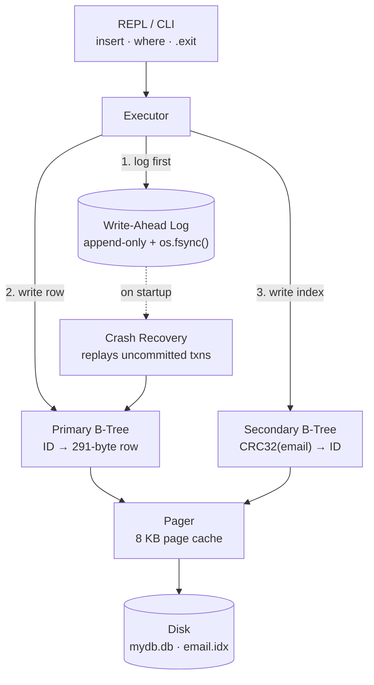

# PyDB — A Relational B-Tree Storage Engine (from scratch)


> A disk-based, transactional database engine written in pure Python with **zero external dependencies** — built to understand how real databases (SQLite, PostgreSQL) work underneath the SQL.

PyDB implements the parts a tutorial usually hand-waves: an **8 KB paged disk manager**, **two B-Tree indexes** (clustered primary + secondary), and a **Write-Ahead Log** with crash recovery — all on top of raw `struct` binary serialization, no ORM, no libraries.

---

## Why I built it

I wanted to stop treating the database as a black box. So I rebuilt the core ideas from first principles:

- How do you store rows on disk so reads stay **O(log N)** instead of a full scan?
- How does a database survive a power-cut **mid-write** without corrupting data?
- Why is the page size (8 KB) the number it is, and what does it buy you?

Every answer in PyDB is code I can step through line-by-line — which makes it the project I most enjoy talking through in interviews.

## Architecture



**The flow of a write:** every `insert` is first appended to the WAL and `fsync`'d to disk *before* the B-Trees are touched. If the process dies between steps, recovery on the next boot replays any transaction that has a `START` but no `COMMIT` — eliminating the dual-write problem.

## How it works

| Component | What it does |
| :-- | :-- |
| **Pager** | Splits the file into strict **8192-byte pages**, manages an in-memory page cache, and is the *only* component that talks to disk — so I/O alignment is controlled in one place. |
| **Primary B-Tree** | Clustered index: 4-byte integer `ID` → the full 291-byte row (`ID(4) + username(32) + email(255)`). Self-balancing via leaf-node splits and root promotion. |
| **Secondary Index** | A second B-Tree mapping a 4-byte `CRC32(email)` hash → primary `ID`, turning an O(N) table scan over emails into an **O(log N)** lookup. |
| **WAL** | Append-only JSON log; `START`/`COMMIT` records flushed with `os.fsync()` give durability and crash recovery. |

## Benchmarks

Measured by `benchmark.py` (10,000 inserts as ACID transactions, then 1,000 random indexed reads):

| Metric | Result | Note |
| :-- | :-- | :-- |
| **Write throughput** | `~2,452 ops/sec` | Deliberately bottlenecked by one `os.fsync()` **per transaction** — the price of true durability. |
| **Indexed read latency** | `~0.295 ms/query` | Two B-Tree traversals (secondary → primary). |
| **Data integrity** | `1000 / 1000` | Zero orphaned indexes or dangling pointers. |
| **Disk footprint** | `~7.37 MB` | 5.59 MB primary · 0.13 MB index · 1.66 MB WAL. |

Reproduce it yourself:

```bash
python3 benchmark.py
```

## Quick start

No dependencies — Python 3.8+ only.

```bash
git clone https://github.com/AnirudhChandan/PyDB.git
cd PyDB
python3 main.py
```

```text
db > insert 1 anirudh anirudh@example.com
Executed.
db > where email=anirudh@example.com
Result: (1, 'anirudh', 'anirudh@example.com')
db > .exit
```

To see crash recovery in action: start an insert, kill the process before `.exit`, and restart — PyDB prints `CRASH DETECTED. Recovering N txns...` and restores the data from the WAL.

## Project structure

```
PyDB/
├── main.py        # Pager, BTree, WAL, and the CLI executor
├── benchmark.py   # throughput / latency / footprint harness
├── mydb.db        # primary store (generated)
├── email.idx      # secondary index (generated)
└── wal.log        # write-ahead log (generated)
```

## Design decisions & tradeoffs

- **fsync per transaction** caps write throughput on purpose — I chose *durability over speed*. Batching commits would multiply throughput but weaken the durability guarantee; that tradeoff is the whole point of the project.
- **Hash-based secondary index** keeps keys a fixed 4 bytes (fast, simple) at the cost of not supporting range scans on email and not yet handling hash collisions (see below).
- **Pager owns all I/O** so the B-Tree logic stays pure in-memory byte manipulation and is easy to reason about.

## Known limitations & roadmap

Being honest about scope is part of the exercise:

- [ ] **Secondary-index hash collisions** are not yet resolved (CRC32 collisions would shadow a row) — next up: collision chaining.
- [ ] **Internal-node splitting** is bounded; a very large tree hits a `FATAL` guard instead of splitting internal nodes recursively.
- [ ] Single-threaded, single-process; no concurrency control / locking yet.
- [ ] Fixed schema (`id, username, email`) and only equality lookups — no SQL parser or range queries.
- [ ] WAL is never truncated/checkpointed, so it grows unbounded.

## What I learned

Paging and block alignment, B-Tree splitting and parent routing, why WAL ordering (`log → fsync → mutate`) is the backbone of ACID durability, and how to design a benchmark that measures the *engine* and not Python's string allocation.

## License

MIT
