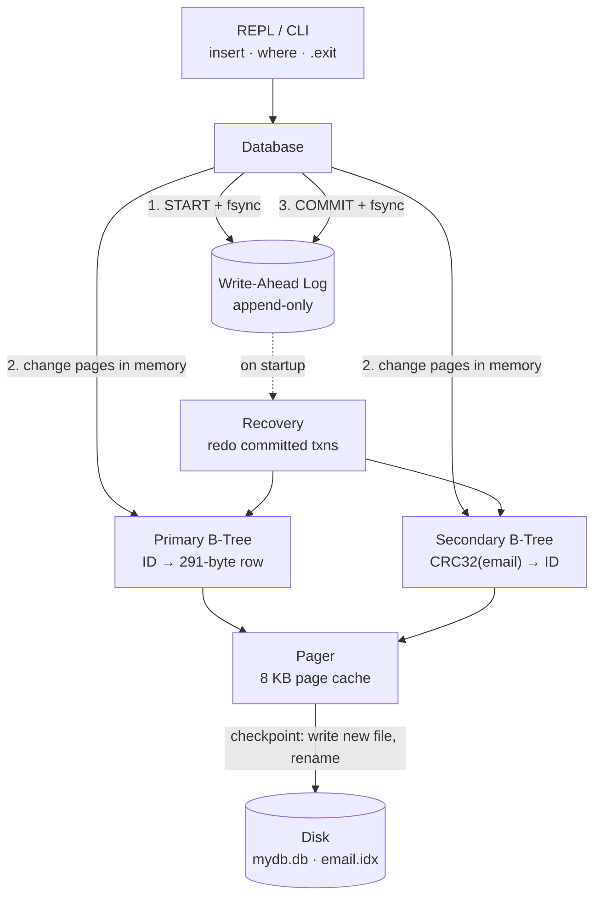

# PyDB — A Relational B-Tree Storage Engine (from scratch)

[](https://github.com/AnirudhChandan/PyDB/actions/workflows/ci.yml)


> A disk-based, transactional database engine written in pure Python with **zero external dependencies** — built to understand how real databases (SQLite, PostgreSQL) work underneath the SQL.

PyDB implements the parts a tutorial usually hand-waves: an **8 KB paged disk manager**, **two B-Tree indexes** (clustered primary + secondary), and a **Write-Ahead Log** with crash recovery — all on top of raw `struct` binary serialization, no ORM, no libraries. The recovery path is tested by killing a real process with `SIGKILL` and checking what the next one finds.

---

## Why I built it

I wanted to stop treating the database as a black box. So I rebuilt the core ideas from first principles:

- How do you store rows on disk so reads stay **O(log N)** instead of a full scan?
- How does a database survive a crash **mid-write** without losing committed data?
- Why is the page size (8 KB) the number it is, and what does it buy you?

Every answer in PyDB is code I can step through line-by-line — which makes it the project I most enjoy talking through in interviews.

## Architecture


```mermaid
flowchart TD
    CLI["REPL / CLI<br/>insert · where · .exit"] --> DB["Database"]
    DB -->|1. START + fsync| WAL[("Write-Ahead Log<br/>append-only")]
    DB -->|2. change pages in memory| PRI["Primary B-Tree<br/>ID → 291-byte row"]
    DB -->|2. change pages in memory| SEC["Secondary B-Tree<br/>CRC32(email) → ID"]
    DB -->|3. COMMIT + fsync| WAL
    PRI --> PG["Pager<br/>8 KB page cache"]
    SEC --> PG
    PG -->|checkpoint: write new file, rename| DISK[("Disk<br/>mydb.db · email.idx")]
    WAL -.->|on startup| REC["Recovery<br/>redo committed txns"]
    REC --> PRI
    REC --> SEC
```

**The flow of a write.** Every `insert` appends a `START` record to the WAL and `fsync`s it, changes the B-Tree pages **in memory only**, then appends and `fsync`s a `COMMIT`. The insert is acknowledged after that second `fsync`.

**Checkpoints.** Data files are never modified in place. At a checkpoint (clean shutdown, or the end of recovery) the pager writes every page to a new file, `fsync`s it, and renames it over the old one; only after both trees are on disk is the WAL truncated. So the files on disk are always a complete tree from *some* checkpoint, never a half-written mix.

**Recovery.** After a crash the data files hold the last checkpoint and the WAL holds everything since. On startup PyDB redoes every transaction that has a `COMMIT` record, in order, and drops any `START` without one. Replay is idempotent (inserting an existing key replaces it), so a crash in the middle of a checkpoint or in the middle of recovery is handled by simply doing it again.

## How it works

| Component | What it does |
| :-- | :-- |
| **Pager** (`pydb/pager.py`) | Splits the file into strict **8192-byte pages**, keeps them in an in-memory page cache, and is the *only* component that talks to the data files. Checkpoints by write-new-file + atomic rename. |
| **B-Tree** (`pydb/btree.py`) | 4-byte integer keys, fixed-size values. Leaf splits with root promotion; the root stays on page 0. |
| **Primary tree** | Clustered index: `ID` → the full 291-byte row (`ID(4) + username(32) + email(255)`). |
| **Secondary index** | A second B-Tree mapping `CRC32(email)` → primary `ID`, turning an O(N) scan over emails into an **O(log N)** lookup. Lookups re-check the email on the row, because the index stores a hash. |
| **WAL** (`pydb/wal.py`) | Append-only JSON lines; `START`/`COMMIT` records flushed with `os.fsync()`. A torn final record from a crash mid-append is ignored. |
| **Database** (`pydb/db.py`) | Ties them together: validation, the write protocol, recovery, checkpoints. |

## Tests

```bash
pip install pytest
pytest
```

20 tests, run in CI on Python 3.9 and 3.12. The ones that matter most:

- **`kill -9` mid-workload** (`tests/test_crash_recovery.py`): a child process inserts rows and acknowledges each on stdout; the test sends `SIGKILL` after 1, 40 and 250 acknowledgements, reopens the database and asserts that every acknowledged insert is present through both trees, and that at most the one in-flight insert exists beyond that — whole or absent, never partial.
- **Crash inside a checkpoint**: the process is killed between checkpointing the two trees, and again after both but before the WAL is truncated. All 300 rows must come back.
- **WAL edge cases** (`tests/test_wal.py`): a `START` with no `COMMIT` is discarded; a torn final record is ignored; a second restart after recovery has nothing left to redo.
- **B-Tree** (`tests/test_btree.py`): 600 random keys across many leaf splits, replace-on-duplicate, persistence across a checkpoint and reopen.

These tests exist because the first version got this wrong: it flushed pages in place only on a clean exit and replayed only *uncommitted* transactions, so killing the process lost every committed insert since the last clean shutdown. A `kill -9` test exposed it.

## Benchmarks

Measured by `benchmark.py` on an M-series MacBook (10,000 inserts as individual transactions, then 1,000 random indexed reads):

| Metric | Result | Note |
| :-- | :-- | :-- |
| **Write throughput** | `~2,650 ops/sec` | Two `os.fsync()` calls **per transaction** (START, COMMIT) — the price of durability. |
| **Indexed read latency** | `~0.20 ms/query` | Two B-Tree traversals (secondary → primary) plus the email check. |
| **Recovery** | `~2.6 s` for 10,000 txns | Full WAL replay plus the checkpoint that follows it. |
| **Disk footprint** | `5.72 MB` | 5.59 MB primary · 0.13 MB index. The WAL peaks at 1.66 MB and is truncated at the checkpoint. |

```bash
python3 benchmark.py
```

## Quick start

No dependencies — Python 3.9+ only.

```bash
git clone https://github.com/AnirudhChandan/PyDB.git
cd PyDB
python3 main.py
```

```text
db > insert 1 anirudh anirudh@example.com
Executed.
db > where email=anirudh@example.com
Result: (1, 'anirudh', 'anirudh@example.com')
db > .exit
```

To see crash recovery in action: insert a few rows, `kill -9` the process instead of typing `.exit`, and start it again — PyDB prints `CRASH DETECTED. Recovered N committed txns from the WAL.` and the rows are there.

## Project structure

```
PyDB/
├── pydb/
│   ├── pager.py     # page cache, atomic checkpoint
│   ├── btree.py     # B-Tree over pages
│   ├── wal.py       # write-ahead log
│   ├── db.py        # row format, write protocol, recovery
│   └── cli.py       # REPL
├── tests/           # pytest suite, including kill -9 crash tests
├── main.py          # entry point for the REPL
└── benchmark.py     # throughput / latency / recovery / footprint
```

## Design decisions & tradeoffs

- **fsync per transaction** caps write throughput on purpose — I chose *durability over speed*. Group commit would multiply throughput at the cost of a small window of acknowledged-but-lost work.
- **No in-place page writes.** Writing pages into the live file means a crash can leave a torn page or half of a split on disk, and then the WAL has nothing sound to replay onto. Write-new-then-rename costs a full file rewrite per checkpoint but makes that failure impossible.
- **Logical WAL records** (the inserted row, not page images) keep the log small and make replay idempotent through replace-on-duplicate.
- **Hash-based secondary index** keeps keys a fixed 4 bytes at the cost of range scans on email and of collision handling (see below).
- **Pager owns all data-file I/O**, so the B-Tree logic stays pure in-memory byte manipulation.

## Known limitations & roadmap

Being honest about scope is part of the exercise:

- [ ] **Checkpoint rewrites the whole file** and the page cache never evicts, so the database has to fit in memory (capped at 5,000 pages ≈ 40 MB per file). Next: dirty-page tracking and a double-write buffer.
- [ ] **Checkpoints only happen on clean shutdown and after recovery**, so the WAL grows for the life of the process.
- [ ] **Secondary-index hash collisions**: two emails with the same CRC32 share one index slot, so the older row is no longer reachable by email (lookups detect the mismatch and report "not found" rather than returning the wrong row). Next: collision chaining.
- [ ] **Internal-node splitting** is not implemented; the tree is two levels deep and raises when the root is full.
- [ ] **`os.fsync` is only as strong as the platform makes it** — on macOS it does not force the drive's write cache (`F_FULLFSYNC` would). Tests cover process death, not power loss.
- [ ] Single-threaded, single-process; no concurrency control or locking.
- [ ] Insert-only, fixed schema (`id, username, email`), equality lookups — no updates, deletes, SQL parser or range queries.

## What I learned

Paging and block alignment, B-Tree splitting and parent routing, why WAL ordering (`log → fsync → mutate`) is the backbone of durability, why "replay the log" only works if the thing you replay onto is consistent, and that a crash-recovery claim is worth nothing until a test kills the process.

## License

MIT
